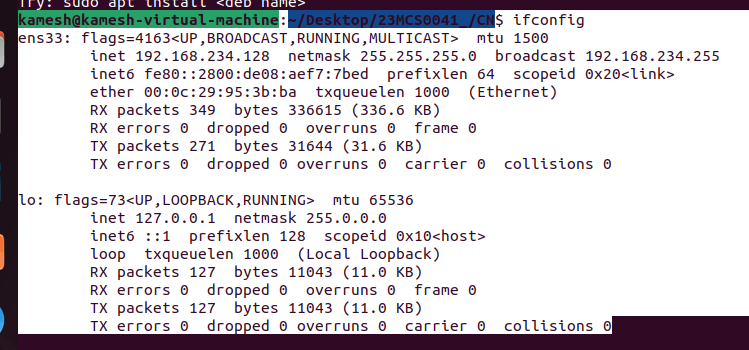

# CN Assignment 2

## Name : Kameshbhai Pravinbhai Suryavanshi

## Reg. No: 23MCS0041

## Sub : CN Lab

Network layer

## 1 . Implement the following IP address conversion
a) Binary to Dotted decimal notation
b) Dotted decimal notation to binary representation

CODE :-                

```java
import java.util.Scanner;

public class Conversion {
    public static String binaryToDecimalIP(String binaryIP) {
        String[] octets = binaryIP.split("\\.");

        if (octets.length != 4) {
            System.out.println("Invalid IP address format.");
            return null;
        }

        StringBuilder decimalIP = new StringBuilder();
        for (String octet : octets) {
            int decimalValue = Integer.parseInt(octet, 2);
            decimalIP.append(decimalValue).append(".");
        }
        decimalIP.deleteCharAt(decimalIP.length() - 1);

        return decimalIP.toString();
    }

    public static String decimalToBinaryIP(String decimalIP) {
        String[] octets = decimalIP.split("\\.");

        if (octets.length != 4) {
            System.out.println("Invalid IP address format.");
            return null;
        }

        StringBuilder binaryIP = new StringBuilder();
        for (String octet : octets) {
            int decimalValue = Integer.parseInt(octet);
            String binaryValue = Integer.toBinaryString(decimalValue);
            while (binaryValue.length() < 8) {
                binaryValue = "0" + binaryValue; // Pad with leading zeros if necessary
            }
            binaryIP.append(binaryValue).append(".");
        }
        binaryIP.deleteCharAt(binaryIP.length() - 1);

        return binaryIP.toString();
    }

    public static void main(String[] args) {
        Scanner scanner = new Scanner(System.in);

        System.out.print("Enter 1 for Binary to Decimal conversion \nEnter 2 for Decimal to Binary conversion ");

        int choice = scanner.nextInt();
        scanner.nextLine(); 

        switch (choice) {
            case 1:
                System.out.print("Enter binary IP address: ");
                String binaryIP = scanner.nextLine();
                String decimalIP = binaryToDecimalIP(binaryIP);
                if (decimalIP != null) {
                    System.out.println("Decimal IP: " + decimalIP);
                }
                break;
            case 2:
                System.out.print("Enter decimal IP address: ");
                String decimalIPInput = scanner.nextLine();
                String binaryIPResult = decimalToBinaryIP(decimalIPInput);
                if (binaryIPResult != null) {
                    System.out.println("Binary IP: " + binaryIPResult);
                }
                break;
            default:
                System.out.println("Invalid choice. enter either 1 or 2.");
        }
    }
}
```

### Output :-



## 2 . Write a program to find first address, last address and number of address from given IP address and mask value.

CODE :-                

```java
import java.util.Scanner;

public class Que2 {

    public static void main(String[] args) {
        Scanner sc = new Scanner(System.in);

        System.out.print("Enter IP address and mask value : ");
        String input = sc.nextLine();

        String[] parts = input.split("/");
        String ipAddress = parts[0];
        int maskValue;

        try {
            maskValue = Integer.parseInt(parts[1]);
        } catch (NumberFormatException | ArrayIndexOutOfBoundsException e) {
            System.out.println("Error: Invalid input formatc");
            return;
        }

        if (maskValue < 0 || maskValue > 32) {
            System.out.println("Error: Invalid mask value.");
            return;
        }

        int numAddresses = (int) Math.pow(2, 32 - maskValue);

        String[] ipOctets = ipAddress.split("\\.");
        StringBuilder binaryIPAddress = new StringBuilder();
        for (String octet : ipOctets) {
            try {
                int octetValue = Integer.parseInt(octet);
                if (octetValue < 0 || octetValue > 255) {
                    throw new NumberFormatException();
                }
                String binaryOctet = Integer.toBinaryString(octetValue);
                while (binaryOctet.length() < 8) {
                    binaryOctet = "0" + binaryOctet;
                }
                binaryIPAddress.append(binaryOctet);
            } catch (NumberFormatException e) {
                System.out.println("Error: Invalid IP address format");
                return;
            }
        }

        StringBuilder networkAddress = new StringBuilder();
        for (int i = 0; i < 32; i++) {
            networkAddress.append(i < maskValue ? binaryIPAddress.charAt(i) : '0');
            if ((i + 1) % 8 == 0 && i != 31) {
                networkAddress.append(".");
            }
        }

        StringBuilder broadcastAddress = new StringBuilder();
        for (int i = 0; i < 32; i++) {
            broadcastAddress.append(i < maskValue ? binaryIPAddress.charAt(i) : '1');
            if ((i + 1) % 8 == 0 && i != 31) {
                broadcastAddress.append(".");
            }
        }

        System.out.println("First Address : " + bTOd(networkAddress.toString()));
        System.out.println("Last Address : " + bTOd(broadcastAddress.toString()));
        System.out.println("Number of Addresses: " + numAddresses);
    }

    private static String bTOd(String binaryIP) {
        StringBuilder decimalIP = new StringBuilder();
        String[] octets = binaryIP.split("\\.");
        for (String octet : octets) {
            int decimalValue = Integer.parseInt(octet, 2);
            decimalIP.append(decimalValue).append(".");
        }
        decimalIP.deleteCharAt(decimalIP.length() - 1);
        return decimalIP.toString();
    }
}
```

### Output :-


## 3.Implement the following routing algorithm
a) Distance vector routing

CODE :-                

```java
import java.util.Scanner;

class Router {
    public int[] dist;
    public int[] from;

    public Router(int size) {
        dist = new int[size];
        from = new int[size];
    }
}

public class DistanceVectorRouting {
    public static void main(String[] args) {
        Scanner scanner = new Scanner(System.in);

        System.out.print("Enter the number of nodes: ");
        int n = scanner.nextInt();

        int[][] dmat = new int[n][n];
        Router[] rt = new Router[n];

        for (int i = 0; i < n; i++) {
            rt[i] = new Router(n);
        }

        System.out.println("Enter the cost matrix:");
        for (int i = 0; i < n; i++) {
            for (int j = 0; j < n; j++) {
                dmat[i][j] = scanner.nextInt();
                dmat[i][i] = 0;
                rt[i].dist[j] = dmat[i][j];
                rt[i].from[j] = j;
            }
        }

        int count;
        do {
            count = 0;
            for (int i = 0; i < n; i++) {
                for (int j = 0; j < n; j++) {
                    for (int k = 0; k < n; k++) {
                        if (rt[i].dist[j] > dmat[i][k] + rt[k].dist[j]) {
                            rt[i].dist[j] = rt[i].dist[k] + rt[k].dist[j];
                            rt[i].from[j] = k;
                            count++;
                        }
                    }
                }
            }
        } while (count != 0);

        for (int i = 0; i < n; i++) {
            System.out.println("\n\nState value for router " + (i + 1) + " is ");
            for (int j = 0; j < n; j++) {
                System.out.println("\t\nnode:" + (j + 1) + " via:" + (rt[i].from[j] + 1) + " Distance :" + rt[i].dist[j]);
            }
        }
    }
}

```

### Output :-


b) Link state routing

CODE :-                

```java
import java.util.Scanner;

public class LinkStateRouting {
    private static int V = 0;

    private static int minDistance(int[] dist, boolean[] sptSet) {
        int min = Integer.MAX_VALUE, min_index = -1;

        for (int v = 0; v < V; v++) {
            if (!sptSet[v] && dist[v] <= min) {
                min = dist[v];
                min_index = v;
            }
        }
        return min_index;
    }

    private static void printSolution(int[] dist) {
        System.out.println("Vertex \t Distance from Source");
        for (int i = 0; i < V; i++) {
            System.out.println(i + "\t" + dist[i]);
        }
    }

    private static void dijkstra(int[][] graph, int src) {
        int[] dist = new int[V];
        boolean[] sptSet = new boolean[V];

        for (int i = 0; i < V; i++) {
            dist[i] = Integer.MAX_VALUE;
            sptSet[i] = false;
        }

        dist[src] = 0;

        for (int count = 0; count < V - 1; count++) {
            int u = minDistance(dist, sptSet);
            sptSet[u] = true;

            for (int v = 0; v < V; v++) {
                if (!sptSet[v] && graph[u][v] != 0 && dist[u] != Integer.MAX_VALUE && dist[u] + graph[u][v] < dist[v]) {
                    dist[v] = dist[u] + graph[u][v];
                }
            }
        }

        printSolution(dist);
    }

    public static void main(String[] args) {
        Scanner scanner = new Scanner(System.in);

        System.out.print("Enter No of Nodes: ");
        V = scanner.nextInt();
        int[][] graph = new int[V][V];

        System.out.println("Enter the Adjacency Matrix:");
        for (int i = 0; i < V; i++) {
            for (int j = 0; j < V; j++) {
                graph[i][j] = scanner.nextInt();
            }
        }

        System.out.print("Enter the Source: ");
        int source = scanner.nextInt();

        dijkstra(graph, source);
    }
}

```

### Output :-

